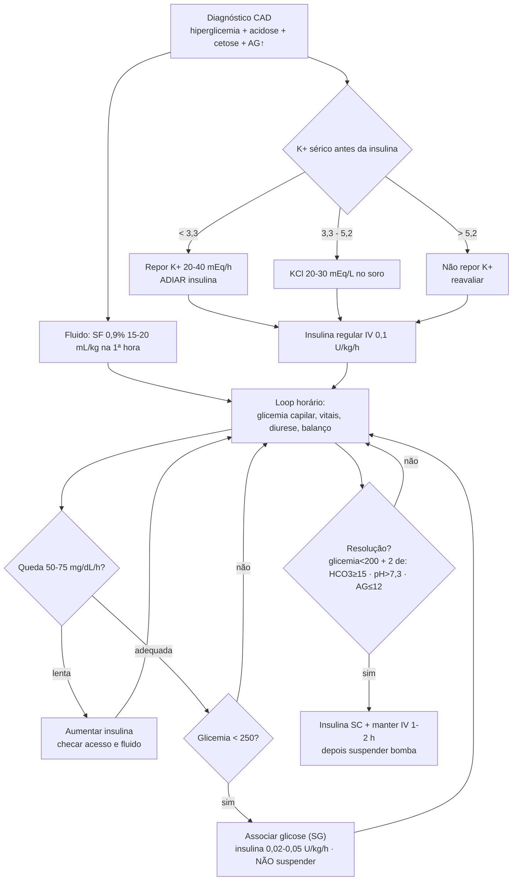

# Cetoacidose Diabética — fluxo clínico

> [!info] Para que serve este documento
> Descreve o **fluxo real de manejo da CAD** que fundamenta a folha de controle de beira-leito (`cad-folha-controle.tex`) e o algoritmo visual. A ideia central: a CAD não é uma lista de condutas, são **três infusões correndo em paralelo no tempo** (fluido · insulina · potássio), com **uma dependência crítica** — o potássio governa o início da insulina.

## Princípio que estrutura tudo

A CAD se trata como **processos concorrentes com um portão (gate)**:

- **Eixo do tempo (vertical):** admissão → 1ª hora → loop horário de titulação → resolução.
- **Linhas paralelas:** fluido, insulina e potássio rodam ao mesmo tempo, não em sequência.
- **O gate:** `K⁺ < 3,3 mEq/L` **adia a insulina** (insulina joga K⁺ para dentro da célula → hipocalemia, principal causa evitável de óbito na CAD).

## Algoritmo de manejo

## Registro de beira-leito — duas cadências distintas

O erro mais comum de folha de controle é pedir tudo de hora em hora. Na prática há **dois ritmos**:

| Cadência | O que se registra |
|---|---|
| **A cada 1 h** | glicemia capilar · PA/FC/FR · Tax/SpO₂ · consciência (Glasgow) · diurese · insulina (UI/h) · fluido (mL/h) · **balanço acumulado** |
| **A cada 2–4 h** | gasometria venosa (pH, HCO₃⁻, ânion gap) · eletrólitos (Na⁺ corrigido, K⁺, Cl⁻) · **cetonemia (β-hidroxibutirato)** |

> [!warning] Alvo da resolução é o ânion gap, não a glicemia
> Glicemia < 250 mg/dL **não** significa resolução. Mantém-se a insulina (associando glicose) até **fechar o gap aniônico** e normalizar o bicarbonato/pH.

## Armadilhas de plantão

> [!danger] Os quatro erros clássicos
> 1. Iniciar insulina **sem dosar potássio** → hipocalemia grave.
> 2. **Suspender** a insulina quando a glicemia cai < 250 → cetose não fecha; o certo é **adicionar glicose** e reduzir a taxa.
> 3. Confundir queda da glicemia com **resolução** (ignorar o ânion gap).
> 4. Em criança: não vigiar **edema cerebral** (cefaleia, vômitos, bradicardia + HAS, rebaixamento).

## Fórmulas de bolso

- **Sódio corrigido** = Na⁺ medido + 1,6 × [(glicemia − 100) / 100]
- **Ânion gap** = Na⁺ − (Cl⁻ + HCO₃⁻); normal ≈ 8–12 mEq/L
- **Bomba de insulina:** 50 UI + 50 mL SF 0,9% ⇒ 1 UI/mL ⇒ **1 mL/h = 1 UI/h** (desprezar 20 mL do equipo)

## Flashcards

> [!note]- Qual o primeiro exame a checar antes de iniciar insulina na CAD? Por quê?
> **Potássio sérico.** A insulina desloca K⁺ para o intracelular; se K⁺ < 3,3 mEq/L, repor primeiro e **adiar** a insulina — hipocalemia é a principal causa evitável de óbito.

> [!note]- Glicemia caiu para 230 mg/dL na CAD. Suspende a insulina?
> **Não.** Associa solução glicosada e reduz a insulina (0,02–0,05 U/kg/h). A insulina só para na resolução, definida pelo ânion gap.

> [!note]- Critérios de resolução da CAD.
> Glicemia < 200 mg/dL **+ dois de:** HCO₃⁻ ≥ 15 mEq/L · pH venoso > 7,3 · ânion gap ≤ 12 mEq/L.

> [!note]- Velocidade-alvo de queda da glicemia (adulto).
> **50–75 mg/dL/h.** Se mais lenta, aumentar a insulina e checar acesso/fluido.

> [!note]- Como se faz a transição para insulina subcutânea?
> Aplicar a insulina SC e **manter a infusão IV por 1–2 h de sobreposição** antes de desligar a bomba (evita rebote da cetose).

> [!note]- O que se monitora de hora em hora vs. a cada 2–4 h?
> **Horário:** glicemia capilar, sinais vitais, diurese, insulina, balanço. **Cada 2–4 h:** gasometria, eletrólitos e cetonemia (β-OHB).

## Artefatos relacionados

- `cad-folha-controle.tex` → folha de controle A4 paisagem, frente e verso. **Pág. 1:** identificação + referência rápida + registro horário + laboratório seriado. **Pág. 2:** algoritmo swimlane (TikZ) + painéis de tratamento + critérios de resolução + alerta de edema cerebral.
- O **swimlane horizontal** (Fluido / Insulina / Potássio × Admissão → Titulação → Glicemia<250 → Resolução) está embutido em TikZ na própria folha — o gate do K⁺ é a seta tracejada que libera a insulina.
